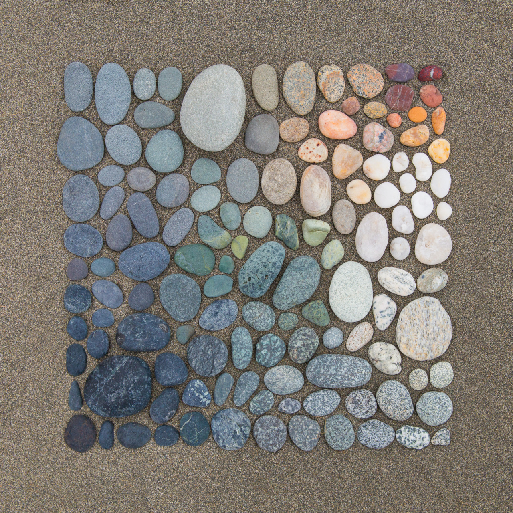

```{r setup, include=FALSE}
#Leave this as-is.
knitr::opts_chunk$set(echo = TRUE,collapse=TRUE)
if( as.numeric( paste( unlist( strsplit( paste(R.Version()$major,R.Version()$minor,sep="."),split="\\.") ),collapse="") ) < 432 ) { 
  stop("You must have R version 4.3.2 or later to knit this document")}
RNGversion("4.3.2")
```

**Instructions:** Ensure this .Rmd file lives in the folder that you've created for this course by doing File, Save As, and forcing a save there. Also ensure that the working directory is your course folder folder by doing Session, Set Working Directory, Choose Directory (you'll see the path right above the Console window). Finally, ensure the image `testimage.jpg` has been downloaded and moved into your course folder as well.

Knit this to a Word document (you do not need to put your name on this document or otherwise modify it). Ensure that the images are showing up and that the output to the final line of code gives 4.3.2 so that you know you're working with the current version of R!

------------------------------------------------------------------------

This is an R Markdown document. Markdown is a simple formatting syntax for authoring HTML, PDF, and MS Word documents. Here is a quick style guide. Note: for this document to knit you MUST have this .Rmd file and testimage.jpg from Canvas in the folder (preferably your business analytics folder).

# Font and style

To make a **word** bold or **a bunch of words**, surround them in double asterisks.

To make a something *italicized*, you only need a single asterisk *on each side* of the phrase.

To make something `appear in R font`, surround it with the back quotes (symbol that shares a key with the `~` on the key)

A superscript can be made by surrounding it with caret symbols `^` like hello^there^

A subscript can be made by surrouding it with `~` symbols like legen~dary~

Strikethrough can be accomplished with double `~` symbols like ~~oops, i did it again~~

<center>Center a line with `<center> text </center>`</center>

Note: centering command only works when knitting to HTML. If in Word, have to manually do it.

# A single hashtag `#` starting a line makes it extremely big and bold

## Two hashtags `##` starting a line make it very big and bold

### Three hashtags `###` starting a line make it big and bold

Note: You cannot insert a page break in a .Rmd file. If you knit to a word document you can work with that document directly. If you knit to an HTML you are at the mercy of how it compiles.

# Lists

If you want to make unordered lists, use an asterisk `*` for each item and a plus sign `+` for each subitem. Be sure to have a blank line between the start of the list and the text above it!

-   Item 1
-   Item 2
    -   Item 2a
    -   Item 2b

If you want to make an ordered list, use a number or letter followed by a period. Be sure to have a blank line between the start of the list and the text above it! You can mix and match ordered and unordered lists.

1.  Item 1
2.  Item 2
3.  Item 3
    a.  Item 3a
    b.  Item 3b

# Tables

The first row of a table gives the column names (separated by the pipe symbol `|`). These names are in bold. If you want to omit a column name, give it the entry `&nbsp;`

The second row exists for reference. Simply put one or more dashes separated by pipe symbols in according to the layout given in the first line.

The third rows and beyond form the rows. The example below manually shows bolding the first entry as if we were going to give it a name, but names are not required. Each entry is separated by the pipe symbol.

|                | First column name | Second column name | Third column name |
|----------------|-------------------|--------------------|-------------------|
| **Row name 1** | Stuff             | in                 | dfsd              |
| **Row name 2** | the               | cells are here     | asdfds            |

# Equations

To make equations look nice and fancy, surround them using a dollar sign or (if you want the equation to be on a line by itself) two dollar signs.

An equation in-line is $a^2 + b^2 = c^2$

An equation on a line all by itself and centered is:

$$\frac{e^{a+bx}}{ 1+e^{a+bx} }$$

Some quick reference for writing equations:

-   The multiplication symbol is written `\times` while other symbols are conventional. Use `/` for division (real mathematicians do not use the division symbol) $$(1+1) + (8-6) + 3 \times 4 - 12/6 = 14$$
-   Powers use the caret symbol `^`. If more than one thing needs to be in an exponent, be sure to put curly braces around the entirety. $$2^3 + a^{-6} - 10^{x+y-2}$$
-   Fractions use `\frac`, then curly brackets separating the numerator and denominator $$\frac{numerator}{denominator}$$

# Horizontal Lines

Three or more asterisks `***` or dashes `---` on a line of its will give a horizontal line, which can be useful for separating homework problems.

------------------------------------------------------------------------

------------------------------------------------------------------------

# Linking to webpages

Putting a URL in between \< \> will make it dynamically link to the page in the final document, e.g., <http://rmarkdown.rstudio.com>.

# Embedding images

Assuming that the image is in the SAME folder as your .Rmd file, you can include the image by doing ``. File format can also be jpg among others.



The image from a website can be directly put into the document by putting the URL in between the parentheses instead of the file name


# Embedding R code

The document will automatically include, run, and show the output of R code by putting the code in a special "chunk", which is three backquotes (same key as `~`) immediately followed by {r} on a line by itself, the chunk of R code on the following lines, followed by another three backquotes on another line by itself.

```{r}
x <- seq(2,45,length=23)
summary(x)
```

If a command makes a plot, the plot will also be included. Note: the document runs ALL R code at once, so you can refer to things defined in previous R chunks.

```{r}
y <- seq(1,2,length=23)
plot(y~x,pch=20,cex=1.2,col=rainbow(23))
```

You have some control over the shape of the plot by adding in `fig.width` and `fig.height`. The defaults are 7 and 5, respectively.

```{r,fig.width=15,fig.height=15}
plot(y~x,pch=20,cex=4,col=grey( seq(0,1,length=23)) )
```

This chunk of code will read in two files: `testdata.csv` and `testenvironment.RData`. If this .Rmd and these two files live in your course folder, and if the working directory is your course folder, then during knitting these should be read in just fine. If you get an error involving Cannot Open Connection:

-   Do a File, Save As, and forceably save this open .Rmd in your course folder
-   Ensure that `testdata.csv` and `testenvironment.RData` are both in your course folder and thave those exact file names, i.e., there aren't any (1) or (2) added to the name which can happen if you download the file more than once. You can rename that files so they match the code.
-   Ensure your working folder is your course folder with (from the top menu) Session, Set Working Directory, and selecting your course folder

```{r reading in files}
TEST1 <- read.csv("testdata.csv")
table(TEST1$Status)
load("testenvironment.RData")
summary(data.for.jackson)
```

The following chunk of code will find out your version of R and embed it into the document. We'll be checking to see if the requested version of R for the semester is installed!

```{r version check, collapse=TRUE}
paste(R.Version()$major,R.Version()$minor,sep=".")
getwd()
```
